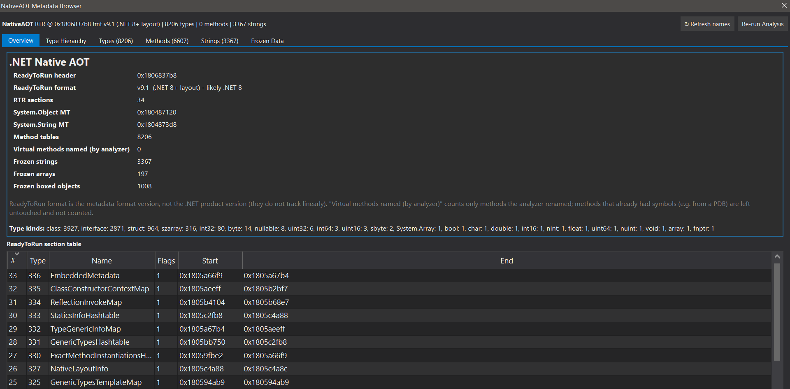
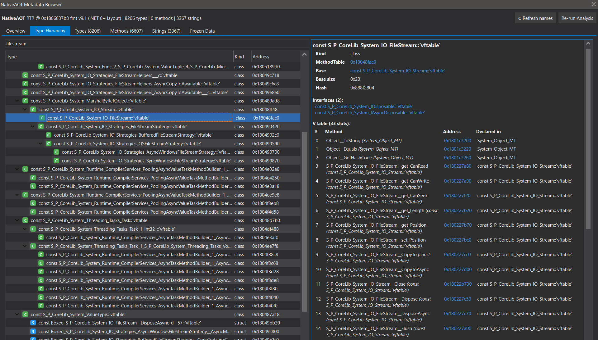
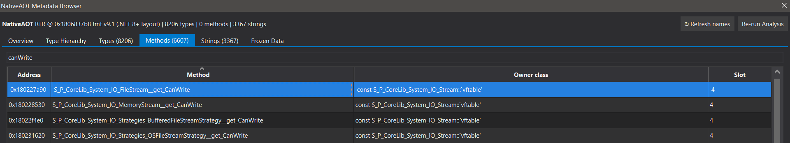
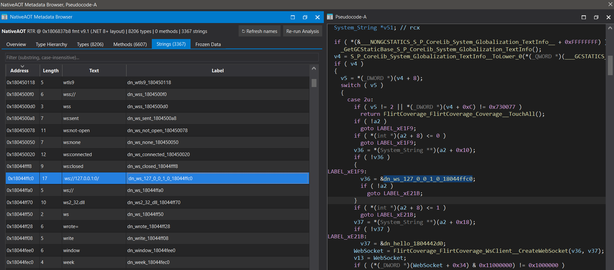

# IDA NativeAOT 🧩

> **Recover .NET Native AOT metadata in IDA Pro — type hierarchy, virtual methods, and string literals from symbol-stripped binaries.**

[](https://www.python.org/)
[](https://hex-rays.com/ida-pro/)
[](LICENSE)

<p align="center">
  
</p>

A two-file IDA Pro plugin that reverse-engineers **.NET Native AOT** binaries (.NET 7/8/9/10).
These ship with stripped symbols, so IDA shows thousands of unnamed `sub_*` functions. The plugin
parses the runtime's **ReadyToRun** metadata to rebuild the .NET type system, name the code, and
present everything in a navigable browser.

This is an IDAPython port of Washi's excellent Ghidra plugin
**[washi1337/ghidra-nativeaot](https://github.com/washi1337/ghidra-nativeaot)**
(see his write-up: [Recovering NativeAOT Metadata](https://blog.washi.dev/posts/recovering-nativeaot-metadata/)).

---

## Compatibility

| IDA Version | Qt | Python Qt Bindings | Plugin Support |
|---|---|---|---|
| **8.x — 9.1** | Qt5 | PyQt5 | **✅ Supported** (requires `pip install PyQt5` in IDA's Python) |
| **9.2+** | Qt6 | PySide6 | **✅ Supported** (developed & tested on **9.3**) |

x86-64 little-endian targets only (as upstream). The Hex-Rays decompiler is optional but recommended.

The plugin auto-detects the Qt binding at runtime via `qt_compat.py`: it prefers PySide6
on IDA 9.2+ and falls back to PyQt5 on IDA 8.x–9.1. On the older branches you must install
PyQt5 into IDA's bundled Python first (IDA does not ship it):

```
<IDA_DIR>\python311\python.exe -m pip install PyQt5==5.15.11 PyQt5-Qt5==5.15.2 PyQt5-sip==12.15.0
```

The analysis engine (`ida-nativeaot.py`) has no Qt dependency and also runs headless under
`idalib` / `idat64 -A -S"ida-nativeaot.py" target.i64` on every supported IDA.

---

## What it does

1. Locates the **ReadyToRun (RTR)** metadata directory (by symbol or signature scan).
2. **Rehydrates** the compressed metadata into the `hydrated` segment (.NET 8+), or falls back to a pointer scan (.NET 7/10).
3. Reconstructs the full **MethodTable / EEType** type hierarchy — base types, interfaces, vtables.
4. Identifies `System.Object` / `System.String` and names virtual methods.
5. Annotates **frozen objects** — string literals, arrays, boxed values.

## What it produces in the IDB

- The previously-empty **`hydrated` segment is populated** with the decompressed metadata.
- **Struct types** (Local Types) for every type: `<Class>_MT`, `<Class>_vtbl`, and the `<Class>` instance layout, with base-class vtable embedding and interface arrays.
- **Method-table labels** `<Class>_MT` at each MethodTable, typed with its struct.
- **Named virtual methods**: `<Class>::Method_N` (slots 0–2 → `ToString`/`Equals`/`GetHashCode`), tagged `__thiscall` with `this` typed — Hex-Rays shows e.g. `void __thiscall Foo::Method_4(Foo *this)`.
- **Frozen string literals**: UTF-16 strings, labelled `dn_<text>_<addr>`, with the exact text as a repeatable comment.
- **Frozen arrays / boxed objects** typed with their instance/element types.
- A text report next to the database (`<input>.naot_report.txt`) and a compressed metadata cache in the IDB (instant browser reopen).

Typical result on a real .NET 8 sample: ~4900 method tables, ~3000 methods named, ~2500 string literals recovered.

---

## The browser

Tabs: **Overview** (RTR info, sections, stats) · **Type Hierarchy** (inheritance tree + per-type
methods/interfaces) · **Methods** · **Strings** · **Frozen Data**. Double-click any row to jump in
IDA; right-click to copy or rename; type kinds have colour icons.

**Live sync** — the browser tracks IDA renames (manual, **FLIRT**, **Lumina**) and updates itself
automatically; **↻ Refresh names** forces a re-read. Right-click **Rename type (propagate)** renames
a class *and* its methods (`Old::M` → `New::M`) without clobbering FLIRT/user-given names. Type and
method names are shown in full and demangled, mirroring any symbols already applied to the database
(e.g. from a PDB).

### Screenshots

*Sample: a NativeAOT build of `FlirtCoverage.dll` (.NET 8) with its PDB applied. The Overview tab is shown at the top of this page.*

**Type Hierarchy** - the `System.IO.FileStream` inheritance chain with the per-type detail pane (base type, interfaces, vtable slots). Names are full and demangled, straight from the applied PDB.



**Methods** - filtering on `canWrite` lands on `FileStream::get_CanWrite`, slot 4 of `System.IO.Stream`.



**Strings** - a recovered frozen literal (`ws://127.0.0.1:0/`) and how it reads inline in the Hex-Rays pseudocode as a `dn_…` label.



---

## Installation

Copy **all three** files into your IDA plugins directory (they must sit together — the plugin loads
the engine and Qt-compat shim from the same folder):

**Per-user (recommended — survives IDA reinstalls):**
```
%APPDATA%\Hex-Rays\IDA Pro\plugins\ida-nativeaot_browser.py
%APPDATA%\Hex-Rays\IDA Pro\plugins\ida-nativeaot.py
%APPDATA%\Hex-Rays\IDA Pro\plugins\qt_compat.py
```

**System-wide:**
```
<IDA_DIR>\plugins\ida-nativeaot_browser.py
<IDA_DIR>\plugins\ida-nativeaot.py
<IDA_DIR>\plugins\qt_compat.py
```

Restart IDA, then open via **`Edit → Plugins → NativeAOT Metadata Browser`** or **`Ctrl-Shift-N`**.
The first run analyzes and caches the metadata into the IDB; subsequent opens are instant.

> `ida-nativeaot.py` is the analysis engine and can also be run standalone, without the GUI, via
> **`File → Script file…`** or headless: `idat64 -A -S"ida-nativeaot.py" target.i64`. It has no Qt
> dependency and runs on every supported IDA.

### IDA 8.x — 9.1 (PyQt5) prerequisites

IDA versions before 9.2 do not ship PyQt5. Install it into IDA's bundled Python once:

```
<IDA_DIR>\python311\python.exe -m pip install PyQt5==5.15.11 PyQt5-Qt5==5.15.2 PyQt5-sip==12.15.0
```

After that, the plugin works identically — `qt_compat.py` selects PyQt5 transparently.

### IDA Plugin Manager (HCLI)

The plugin ships an `ida-plugin.json`. The Plugin Manager installs the whole plugin directory,
which includes `ida-nativeaot_browser.py` (the `entryPoint`), `ida-nativeaot.py` (the analysis
engine), and `qt_compat.py` (the Qt5/Qt6 compatibility shim). Once published to
plugins.hex-rays.com, install with:

```
hcli plugin install ida-nativeaot
```

---

## License

Licensed under the **MIT License** — see [LICENSE](LICENSE). This is a derivative work ported from
the MIT-licensed [washi1337/ghidra-nativeaot](https://github.com/washi1337/ghidra-nativeaot).

---

## Credits

**Original research & Ghidra plugin:** [Washi](https://github.com/washi1337)
([@washi1337](https://github.com/washi1337)) — [ghidra-nativeaot](https://github.com/washi1337/ghidra-nativeaot)
and the blog post [Recovering NativeAOT Metadata](https://blog.washi.dev/posts/recovering-nativeaot-metadata/).
This IDA plugin is a faithful port of his work.

**IDA port & browser UI:** Jiří Vinopal
&nbsp;&nbsp;X / Twitter: [@vinopaljiri](https://x.com/vinopaljiri)
&nbsp;&nbsp;GitHub: [Dump-GUY](https://github.com/Dump-GUY)
